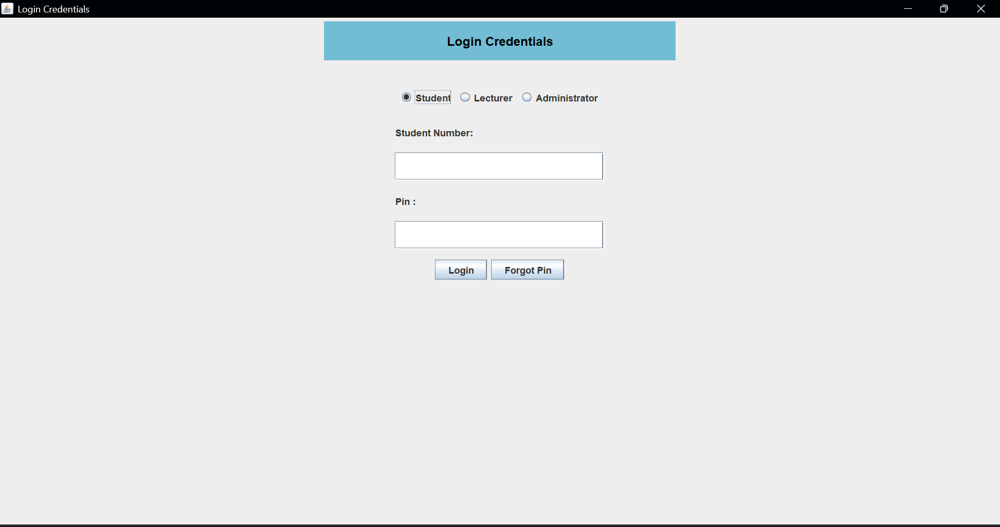

📌 Project Overview

# java-login-GUI
A Java Swing login GUI demonstrating basic components such as JFrame, JPanel, JTextField, JPasswordField, and radio buttons.

It was developed as part of learning Java GUI programming and demonstrates how to create a login interface using Swing components.

The application allows users to select a role and enter login credentials through a graphical interface.

🛠 Technologies Used

Java

Java Swing

AWT Layout Managers

🎯 Features

User role selection using Radio Buttons (Student, Lecturer, Admin)

Input fields for Student Number

Secure PIN entry using JPasswordField

GUI built using JFrame, JPanel, and layout managers

Centered login interface design

📷 Screenshot

🚧 Project Status

⚠️ This project is currently a work in progress and is mainly focused on understanding GUI design and layout management in Java. Some functionality may still be incomplete.

📚 Learning Objectives

The goal of this project is to practice:

Java Swing components

Layout managers such as BorderLayout and FlowLayout

Event handling in Java GUI applications

🔮 Future Improvements

Add login validation

I am going to connect the login system to a database

Improve UI design and responsiveness

Implement error messages for incorrect input

👨‍💻 Authors
Phindile Khumalo, Zusakhe Noguda and Asemahle Meyi
Computer Science Students
GitHub: https://github.com/PhindileKhumalo
Created as part of learning Java programming and GUI development.
